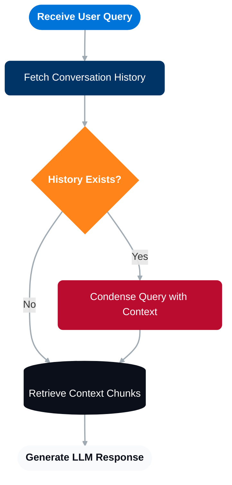

# Xecai - Cross compatible and extendable AI interface

Develop code for different LLMs and AI services, change very few lines. Easily customise the behaviour so that it fits your requirements.


> This library is currently focused on RAG purposes, no Agent implementation (this may change in the future).


## Examples

### Chat interface

<details>

```python
from chat.implementations.openai.openai_chat import OpenAIChat


messages = [Message(content="what model are you?", message_type=MessageType.USER)]
prompt = "you are a helpful bot"
model = "gpt-4o"
chat = OpenAIChat()
chat.check_model(model)

response, stats = chat.invoke(model, prompt, messages)
print(response)

for text, stats in chat.stream(model, prompt, messages):
    if text:
        print(text, end="", flush=True)
```

</details>


### VectorDB interface

<details>

```python
from vector_db.implementations.postgresql.postgresql_vector_db import PostgreSQLVectorDB
from embeddings.implementations.openai.openai_embedding import OpenAIEmbedding
from models import SearchType

vector_db = PostgreSQLVectorDB(
    embedding_interface=OpenAIEmbedding(), embedding_model="text-embedding-3-small"
)

chunks = vector_db.sync_retrieve(
    query="this is an example query",
    k=3,
    search_type=SearchType.HYBRID,
)
print(chunks)
```

</details>

### Memory interface

<details>

```python
from memory.implementations.postgresql.postgresql_memory import PostgreSQLMemory
from models import Conversation, Message, MessageType

memory = PostgreSQLMemory()

conversation = memory.sync_get_conversation("example_conversation_id") else Conversation()
print(conversation)

conversation.messages.append(Message(message_type=MessageType.USER, content="example query"))
memory.sync_save_conversation(conversation)
```

</details>


## Typical rag workflow



You can find an example of the typical RAG implemented with FastAPI on `examples/simple_rag.py`.


## Differences with projects that have a  similar objective

| Library | Notes |
| ------- | ----- |
| JustLLMs | Requests are made directly with http. More LLMs supported and many more features (agents, tools, etc.). I personally prefer using the official SDKs.  |
| LiteLLM & Agents SDK + LiteLLM | Local proxy router where you send the requests to be translated, adds complexity to the project and another element to the infrastructure. |
| LangChain | The most popular one. Bloated in some features, complex implementations that make it difficult to change its behaviours. |
| OpenRouter | All requests are sent to a 3rd party + additional charges. |

## Notes

- I will implement Azure OpenAI's chat implementation if this gets enough traction (I don't want to loose my free Azure credits unless it is worth it).
- Retries are left to the user to put and customise (check out `examples/retry_example.py`), as it adds a lot of complexity to have a default retry logic but also let the user modify it.
- Agents and tools will be evaluated later, the focus is to make this library simple and not bloated, providing the core functionalities and letting you easily extend them.
