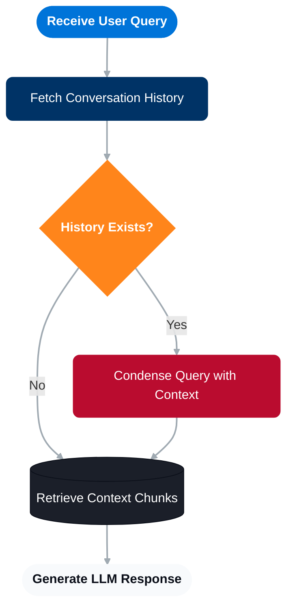

# Xecai - Minimalistic, provider-agnostic, AI python library

Develop code for different AI services and providers, change very few lines. Easily customise the behaviour so that it fits your requirements.


## Examples

### Chat interface

```python
from xecai.chat.implementations.openai.openai_chat import OpenAIChat
from xecai.models import Message, MessageType


messages = [Message(content="what model are you?", message_type=MessageType.USER)]
system_prompt = "you are a helpful bot"
model = "gpt-4o"
chat = OpenAIChat()
chat.check_model(model)

response = chat.invoke(model, system_prompt, messages)
print(response)

for chat_response in chat.stream(model, system_prompt, messages):
    if chat_response.text:
        print(chat_response.text, end="", flush=True)
```

### Agent interface

```python
import asyncio
from typing import Any
from xecai.agents.implementations.openai.openai_agent import OpenAIAgent
from xecai.agents.agent_interface import WebSearchTool, tool
from xecai.models import Message, MessageType


@tool
def divide(args: dict[str, Any]) -> Any:
    """Divide number 'a' by number 'b'. Requires 'a' and 'b'."""
    a = float(args.get("a", 0))
    b = float(args.get("b", 1))
    if b == 0:
        result = "Error: Division by zero"
    else:
        result = a / b
    print(f"\n  [Tool used: divide(a={a}, b={b}) -> {result}]")
    return result


async test():
    system_prompt = (
        "You are a helpful search assistant. "
        "Always use the tools provided to get accurate information, "
        "otherwise say you can't do it. Don't say approximately, use the exact tool result value."
    )
    model = "gpt-4o"
    agent = OpenAIAgent()
    scenarios = [
        ("what global news happened today?", [WebSearchTool]),  # Web search example
        ("divide 234324.23423 by 342.124324234", [divide])      # Custom function example
    ]
    for user_query, tools in scenarios:
        messages = [Message(content=user_query, message_type=MessageType.USER)]
        response = await agent.async_run(
            model_name=model,
            system_prompt=system_prompt,
            messages=messages,
            tools=tools,
        )
        print(response)

asyncio.run(test())
```


### VectorDB interface

```python
from xecai.vector_db.implementations.postgresql.postgresql_vector_db import PostgreSQLVectorDB
from xecai.embeddings.implementations.openai.openai_embedding import OpenAIEmbedding
from xecai.models import SearchType

vector_db = PostgreSQLVectorDB(
    embedding_interface=OpenAIEmbedding(), embedding_model="text-embedding-3-small"
)

chunks = vector_db.sync_retrieve(
    query="this is an example query",
    k=3,
    search_type=SearchType.HYBRID,
)
print(chunks)
```

### Memory interface

```python
from xecai.memory.implementations.postgresql.postgresql_memory import PostgreSQLMemory
from xecai.models import Conversation, Message, MessageType

memory = PostgreSQLMemory()

conversation = memory.sync_get_conversation("example_conversation_id") or Conversation()
print(conversation)

conversation.messages.append(Message(message_type=MessageType.USER, content="example query"))
memory.sync_save_conversation(conversation)
```

### Embedding interface

```python
from xecai.embeddings.implementations.openai.openai_embedding import OpenAIEmbedding

embedding = OpenAIEmbedding()

vector = embedding.sync_get_embeddings("This is a test document.", "text-embedding-3-small")
print(len(vector))
```

### Reranker interface

```python
from xecai.reranker.implementations.aws.aws_reranker import AWSReranker
from xecai.models import Chunk

reranker = AWSReranker()

chunks = [
    Chunk(content="A document about cats.", document="doc1", origin="web", fragment=0),
    Chunk(content="A document about dogs.", document="doc2", origin="web", fragment=0)
]

reranked_chunks = reranker.sync_rerank("tell me about cats", chunks, k=1)
print(reranked_chunks)
```


## Typical rag workflow

### Diagram

<details>



</details>

You can find an example of the typical RAG implemented with FastAPI on `examples/simple_rag.py`.


## Differences with projects that have a  similar objective

| Library | Notes |
| ------- | ----- |
| JustLLMs | Requests are made directly with http. More LLMs supported and many more features (agents, tools, etc.). I personally prefer using the official SDKs.  |
| LiteLLM & Agents SDK + LiteLLM | Local proxy router where you send the requests to be translated, adds complexity to the project and another element to the infrastructure. |
| LangChain | The most popular one. Bloated in some features, complex implementations that make it difficult to change its behaviours. |
| OpenRouter | All requests are sent to a 3rd party + additional charges. |

## Notes

- I will implement Azure OpenAI's chat implementation if this gets enough traction (I don't want to loose my free Azure credits unless it is worth it).
- While using Chat objects, retries are left to the user to put and customise (check out `examples/retry_example.py`), as it adds a lot of complexity to have a default retry logic but also let the user modify it.
